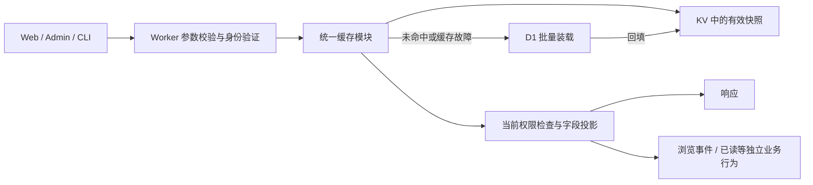

# 20 — 统一缓存架构与验收

> 状态：实现已接入，正在完成发布前验证；部署记录见第 10 节。更新日期：2026-09-17。
>
> 本文是缓存实现与验收的统一依据，替代原有的用户缓存重构、Worker KV 架构和 KV 参考文档。功能文档涉及缓存时引用本文；第 1 节保留迁移前的问题，第 4 节和第 10 节记录接入范围与验证状态。

目标是让论坛的大部分重复读取由缓存承担，降低 D1 的实际读取行数、写入行数和查询次数。**所有业务数据缓存统一为三档：60 秒、30 分钟、24 小时，最短 60 秒是硬约束。** 每个读接口都要说明如何复用数据，并通过测试证明缓存命中、过期、更新、故障时的行为。

## 1. 迁移前的问题

以下是本轮开始时的源码调查结果，用于解释改造原因；不代表迁移后的运行状态，也不包含线上命中率或成本测量。

| 范围 | 迁移前实现 | 本轮变化 |
| --- | --- | --- |
| 版块 | 结构树、摘要、详情均为 24 小时；摘要与所有版块详情共享全局版本，回帖也会更新这个版本 | 结构与动态字段分开；普通回帖不触发全站重建 |
| 主题列表 | 60 秒，只缓存默认排序、无分类筛选的第一页，limit 限 20/50/100 | 覆盖所有合法分页、筛选和排序，控制参数组合的数量 |
| 精华、设置、统计 | 精华统计与筛选为 1 小时；settings 与 public-stats 为 15 分钟 | 分别归入三档，不再由调用方自由填写 TTL |
| 用户、推荐、分类 | 用户 mini 为 24 小时，但受开关控制；推荐与主题分类也为 24 小时 | 批量用户读取统一接入；组合结果减少复制头像、用户名和动态计数 |
| 外部查询 | IP 归属地使用 `ip-lookup:<ip>`，TTL 为 24 小时 | 归入统一模块，外部请求节约与 D1 节约分别核算 |
| 核心阅读链路 | 主题详情、回帖列表、搜索结果等大量查询仍回源；部分 key 已声明却没有读路径 | 优先补齐正文、回帖、关联数据和深分页，登记状态与实际调用一致 |
| 额外数据库写入 | 主题详情读取会增加浏览量；metadata 与正文可能重复读取；缓存指标自身也写 D1 | 数据加载去重，副作用独立执行，指标开销计入总成本 |
| 前端 | 混用请求级去重、Next.js revalidate、浏览器缓存；发帖权限预览有 30 秒缓存 | 统一时间规则，避免多层缓存重新起算有效期 |
| 后台管理 | 已有 family 总览、分页 key 列表、内容弹窗和近 60 分钟趋势；“刷新”主要执行版本更新或删除，操作能力因 family 而异 | 统一生命周期展示、单条预览/重建/删除，并展示应用自身采集的运行趋势与占用估算 |

迁移入口是现有的 [cache 模块](../apps/worker/src/lib/cache/wrap.ts)、[KV 登记表](../apps/worker/src/lib/cache/kv-registry.ts)、[失效 helper](../apps/worker/src/lib/cache/invalidate.ts)、[用户批量缓存](../apps/worker/src/lib/user-cache.ts)、[缓存指标](../apps/worker/src/lib/cache/metrics.ts)和 [Web 请求级去重](../apps/web/src/lib/forum-cache.ts)。在这些入口上收敛实现，不另建一套平行框架。

## 2. 三档时间契约

| 档位 | 唯一允许的 TTL，单位秒 | 用途 |
| --- | ---: | --- |
| `SHORT` | **60** | 动态列表、计数、搜索、个人状态的展示快照 |
| `MEDIUM` | **1800** | 主题和回帖正文、资料详情、精华聚合等相对稳定的数据 |
| `LONG` | **86400** | 版块结构、展示设置、用户 mini、分类、附件元数据等稳定数据 |

共享的纯数据定义只暴露档位，调用方不能传任意秒数：

```ts
export const CACHE_TTL_SECONDS = {
  SHORT: 60,
  MEDIUM: 1800,
  LONG: 86400,
} as const;

export type CacheTier = keyof typeof CACHE_TTL_SECONDS;
```

约束如下：

1. **禁止小于 60 秒的业务 TTL。** 30 秒缓存、毫秒/秒混用，以及随机抖动后低于 60 秒，都必须被测试拒绝。也不新增 5 分钟、15 分钟、1 小时等其他档位。
2. TTL 是固定有效期。命中不续期，复制到下一层不续期，回填重试不续期。缓存包保存 `schemaVersion`、`loadedAt`、`expiresAt` 和 `data`；读取时校验时间与结构。
3. 冷加载的逻辑有效期从本次数据装载完成时起算；聚合数据另记录源快照时间。由其他缓存组合出的结果，截止时间不得晚于最早到期的依赖。缓存 TTL 不等于源数据的新鲜程度。
4. KV 回填的 `expirationTtl` 只使用这三个值；读取同时检查包内的 `expiresAt`。慢回填或重试留下的物理记录，不能延长逻辑有效期。已经逻辑过期的值不得回填。
5. 空列表和确认不存在的资源也可缓存，统一使用 `SHORT`；不存在结果必须带资源类型与可见性范围。网络故障、D1 错误、鉴权失败不能伪装成空结果缓存。
6. 60 秒约束自动刷新周期。内容编辑、删除、权限撤销等明确变更，以及第 8 节中管理员主动执行的刷新/删除，可以触发主动失效；**普通回帖、浏览量增长不能反复清空动态列表或全站摘要，使 60 秒缓存事实上只活几秒。** 高频展示数据优先等 `SHORT` 自然过期。
7. 写后本人立即看到结果，优先使用写接口返回的数据更新界面。其他读者通过快照更新看到变化；严格的新鲜读取与权限撤销按第 6 节处理。
8. 默认不提供超过 `expiresAt` 的过期内容，也不设置额外的 stale 窗口。故障不能把 60 秒自动变成无限期可用。

Cloudflare KV 的 `expirationTtl` 最小为 60 秒。KV 读取侧的 `cacheTtl` 是平台内部读缓存参数，和业务 TTL 不同；即使平台允许更小值，本项目的业务缓存适配器也不得用小于 60 秒的配置绕过上述契约。

## 3. 模块边界与读取流程

Worker 是跨请求业务缓存的统一入口，沿用 D1 + KV。Web、Admin 和 CLI 复用同一套业务策略。



### 3.1 一份登记表决定策略

扩展现有登记表，业务缓存至少登记以下信息；运行时和测试读取同一份定义。

| 信息 | 要求 |
| --- | --- |
| family、schema version、接入状态 | 能区分已接入、迁移中、已停用；只有 key builder 不算接入 |
| tier | 只能是 `SHORT`、`MEDIUM`、`LONG` |
| scope 与 key 参数 | 明确公共、角色等价范围、具体用户；包含影响结果的全部参数 |
| 数据结构与校验 | 缓存值是可验证的数据，不保存整份带 Cookie、Token 的 HTTP Response |
| 更新规则 | 选择自然过期或明确的主动失效事件，声明作用到哪些资源 |
| 装载与批量方式 | 查询什么、怎样复用实体、怎样合并缺失项 |
| 成本与容量 | 命中路径 D1 预算、最大条目大小、分页/查询参数边界 |
| 故障处理 | 回源规则、失效失败记录、哪些错误不能缓存 |
| 后台管理能力 | 内容预览规则、可还原的规范化参数、原始用户范围，以及单条重建/删除入口；停用或受限项注明原因 |

模块统一负责 key、读写、校验、时间、并发装载去重、批量读取、失效和指标。Handler 提供业务查询与权限逻辑。业务缓存读写不得继续散落为独立的 `KV.get/put/delete`；运行状态存储走自己的明确入口。

失效依赖用少量领域 helper 和显式表维护即可，例如“主题移动影响源版块和目标版块”。一次变更先用 `Set` 去重受影响 ID，再调用 helper，无需通用事件总线或动态依赖图。

### 3.2 Key 和用户隔离

Key 包含 family、schema version、资源 ID、规范化参数、可见性范围，以及确有需要的资源版本。

- 分页方式、page/cursor、limit、排序、分类、精华等级、年份、搜索词、用户 ID、收件箱/发件箱等，凡是会改变结果的都必须参与 key。只有语义等价的默认值才合并。
- 查询先验证和规范化再编码；长参数使用稳定摘要，保留足够的碰撞防护。不得把 JWT、Cookie、refresh token 或邮件验证码放入 key。
- `anon/member/staff/admin` 只适用于响应确实相同的场景。当前角色数字并不按权限大小排列，不能用数字比较构造权限分组。
- “本人/其他会员”、版块版主身份、匿名作者展示、私信归属都可能超出角色分组。优先缓存可复用实体，在响应前按当前用户投影；确需缓存个性化结果时使用准确的用户范围。
- `user:mini` 与公开资料、本人资料、管理资料采用字段白名单。不能因为读了同一个用户 ID，就复用权限更宽的缓存结果。
- 指标与调试输出使用 family、结果、大小和耗时，不输出私信正文、凭据或完整私有 key；管理工具读取缓存值也要执行相应的权限和脱敏规则。

### 3.3 组合数据与前端

列表优先保存 ID、排序和分页信息；正文、用户展示信息、动态计数按实体批量组合。内部拆分可以保持现有 API 返回结构，不要求客户端逐条发请求。

例如推荐列表保存推荐主题 ID 和人工排序，标题取主题实体，作者取用户 mini，回复数取动态统计。修改头像或新增回复不再要求删除所有复制过这些字段的推荐、版块和主题列表。

Next.js 到 Worker 的业务读取默认 `no-store`，请求内允许 React `cache()` 等去重。metadata 使用独立的 `X-Ellie-Read-Purpose: metadata` 读取，并在各自的请求内去重；metadata 与页面正文复用 Worker 实体缓存，只有正常页面阅读产生浏览事件。浏览器保留展示快照时继承上游截止时间；需要新增缓存策略时仍从三档中登记。继承上游剩余有效期不属于新建一个更短的 TTL 档位。

切换账号、退出登录、权限范围变化时清理对应的私有前端快照。不得对带用户身份的响应直接启用共享 HTTP 页面缓存。

## 4. 缓存覆盖范围

下表定义接入策略，实际入口及明确例外见第 4.2 节。低流量、深分页、有搜索词或来自 Admin，都不能成为默认不缓存的理由。优先缓存可复用部分，合法请求仍按现有 API 语义返回。

| 数据 | 档位 | 范围与更新方式 |
| --- | --- | --- |
| 版块树、祖先路径、稳定详情、版主展示信息 | `LONG` | 结构变更时失效；不混入帖子数、最后回复等字段；响应前应用当前可见性 |
| 主题分类、公开展示设置、导航与功能文案 | `LONG` | 配置修改时失效；涉及登录保护、访问控制或写入许可的判断独立读取权威状态 |
| 版块摘要、最近可见主题、帖子数、回复数 | `SHORT` | 普通发帖回帖等自然过期；“最后主题”必须按当前可见性选择 |
| 主题列表 | `SHORT` | 所有合法页码、游标、limit、排序与分类；全局公告单独复用，避免复制到每个版块 |
| 主题标题与正文相关稳定字段 | `MEDIUM` | 按主题复用，编辑时失效；权限、删除状态和浏览事件不由缓存决定 |
| 主题动态统计 | `SHORT` | 浏览量、回复数、最后回复时间；不因每次访问或回复主动失效 |
| 回帖分页索引 | `SHORT` | 覆盖全部分页，不只第一页；新回复等自然过期，删除/移动按变更处理 |
| 单条回帖正文 | `MEDIUM` | 列表和详情复用，编辑/删除时失效；删除占位遵循现有展示规则 |
| 评论列表、评分汇总及评分明细 | `SHORT` | 按主题/帖子和分页组合；提交结果更新当前界面，额度判断由写接口确认 |
| 附件元数据、帖子图片信息、头像路径映射 | `LONG` | 上传、替换、删除后失效；下载授权与临时签名单独处理 |
| 推荐主题 ID 与人工排序 | `LONG` | 推荐配置、删除、移动等影响成员关系时失效；展示字段复用对应实体与统计 |
| 精华列表、统计、年份/版块筛选 | `MEDIUM` | 缓存全部合法组合；精华级别、移动、删除、版块可见性变化时失效 |
| 用户 mini：用户名、头像、展示组信息 | `LONG` | 所有用户富化路径共用；资料变化按用户失效，不作为权限依据 |
| 公开用户资料的稳定字段 | `MEDIUM` | 当前用户可见字段投影；动态计数使用 `SHORT`，私有字段另行隔离 |
| 用户主题、回复、精华等历史列表 | `SHORT` | 覆盖全部分页；复用主题/回帖实体 |
| 用户批量接口 | 继承实体档位 | 按 ID 读取上述实体缓存，不为每种 ID 排列创建整批缓存 |
| 主题搜索、用户搜索结果 | `SHORT` | 规范化搜索条件和分页；控制 key 数量，复用用户与内容实体；空结果同档 |
| 公共统计、在线人数展示、今日统计展示 | `SHORT` | 读取已有聚合快照；不在命中路径重新 COUNT 全表或遍历在线 KV |
| 本人资料展示、签到状态、发帖权限预览 | `SHORT` | 具体用户范围；真实提交、封禁、余额、额度和邮箱验证判断重新确认 |
| 私信列表、未读数、私信正文 | `SHORT` | 具体用户、箱体、分页/消息 ID；每次校验归属，发送/删除/已读后处理受影响用户 |
| Admin / 版主管理列表、详情、举报和日志展示 | `SHORT` | 准确的管理权限范围；执行操作时读取权威状态，实体变更后更新对应后台资源版本，编辑界面使用写入结果 |
| 管理分析报表、历史聚合 | `MEDIUM` | 日期范围和权限入 key；统计校准完成后失效；不可变的归档结果可单独登记 `LONG` |
| IP 归属地等外部查询结果 | `LONG` | 也走统一模块，但成本归入外部请求节约，不能算成 D1 节约 |

### 4.1 边界内仍有不能按普通缓存处理的内容

| 类型 | 处理规则 |
| --- | --- |
| 写入、鉴权、授权、唯一性与额度校验 | 读取当前权威状态；可复用本次请求已验证的结果，不能用展示缓存批准操作 |
| 登录会话、refresh token、验证码、锁定状态、限流、作业状态 | 属于运行状态，有自身生命周期与原子性要求；不能参与“清空业务缓存” |
| 在线 presence、活动节流标记、统计累计值 | 属于信号或状态；它们的窗口、保留期与业务缓存 TTL 分开，展示快照仍用三档 |
| 缓存版本元数据 | 按 family/schema 的依赖生命周期管理；不属于业务数据快照，不能与普通数据一起按 TTL 清理 |
| 健康检查、流式任务进度等必须探测当前状态的读取 | 登记明确原因与成本，不缓存探测结果；任务的静态描述仍可缓存 |
| 带内容版本的图片、头像文件、静态构建资源 | 使用独立的 HTTP/CDN 资源策略，可长期 immutable；可变路径映射与元数据按上表缓存 |

这些边界不能用来把整个私信、管理后台或登录用户读取排除在缓存之外。每个例外必须列出具体字段/行为和验证用例。

### 4.2 读路由接入清单

下表逐项对应 Worker 的 80 个 GET 分支。整份复用指 handler 的展示数据可复用；所有入口仍执行路由层身份验证。部分复用另外保留当前权限、实体组合或必要业务行为，不承诺整个请求零 D1。POST 批量读取沿用相应实体 family；写接口不纳入展示快照。

[架构检查](../apps/worker/tests/unit/lib/cache/architecture.test.ts)要求每个 GET 分支都有一行登记，缓存入口传递 `ctx`，所列 family 已接入，并限制直接 KV I/O 的模块边界。它是静态防遗漏检查，行为保证由以下证据组验证。

- T1：[版块读取](../apps/worker/tests/unit/lib/cache/forum-read.test.ts)、[版块摘要失效](../apps/worker/tests/unit/handlers/forum-summary-invalidation.test.ts)。
- T2：[主题/回帖装载及预算](../apps/worker/tests/unit/lib/cache/thread-loaders.test.ts)、[列表分页](../apps/worker/tests/unit/lib/cache/thread-list-read.test.ts)、[变更矩阵](../apps/worker/tests/unit/handlers/admin/cache-invalidation.test.ts)。
- T3：[搜索、精华、推荐和分类](../apps/worker/tests/unit/lib/cache/catalog-read.test.ts)。
- T4：[用户读取](../apps/worker/tests/unit/lib/cache/user-read.test.ts)、[私信、签到与本人资料](../apps/worker/tests/unit/lib/cache/private-read.test.ts)、[设置/统计/mini](../apps/worker/tests/unit/lib/cache/peripheral-loaders.test.ts)。
- T5：[Admin 实体与批量](../apps/worker/tests/unit/lib/cache/admin-entity-read.test.ts)、[公告筛选](../apps/worker/tests/unit/handlers/admin/announcement-cache.test.ts)。
- T6：[Admin 展示和报表](../apps/worker/tests/unit/lib/cache/admin-report-read.test.ts)、[IP 查询](../apps/worker/tests/unit/handlers/admin/ip-lookup.test.ts)。
- T7：[管理接口](../apps/worker/tests/unit/handlers/admin/kv.test.ts)、[监控快照](../apps/worker/tests/unit/lib/cache/admin-monitor-read.test.ts)、[纯重建分派](../apps/worker/tests/unit/lib/cache/manage-dispatch.test.ts)。
- T8：[路由集成](../apps/worker/tests/unit/router.test.ts)。
- T9：[认证](../apps/worker/tests/unit/handlers/auth.test.ts)、[版主权限](../apps/worker/tests/unit/handlers/moderation.test.ts)、[IP 封禁](../apps/worker/tests/unit/handlers/admin/ipBan.test.ts)。
- T10：[帖子图片](../apps/worker/tests/unit/lib/postImage.test.ts)。
- T11：[统计任务](../apps/worker/tests/unit/handlers/admin/statistics-cache.test.ts)、[显式校准](../apps/worker/tests/unit/handlers/admin/statsCalibrate.test.ts)。

| Handler | GET 路径 | 策略 | 登记 family | 当前检查 / 测试证据 |
| --- | --- | --- | --- | --- |
| `handlers/live.live` | `/api/live` | 明确例外 | — | T8；探测当前健康及版本，不缓存探测结果 |
| `handlers/forum.list` | `/api/v1/forums` | 部分复用 | `forum:tree:v2`、`forum:summary:v2` | T1；当前版块可见性和最后主题候选检查 |
| `handlers/forum.getAncestors` | `/api/v1/forums/:id/ancestors` | 部分复用 | `forum:tree:v2` | T1；当前祖先路径可见性 |
| `handlers/forum.getThreadTypes` | `/api/v1/forums/:id/thread-types` | 部分复用 | `thread-types` | T3；当前版块权限 |
| `handlers/recommended.listRecommendedThreads` | `/api/v1/forums/:id/recommended-threads` | 部分复用 | `recommended:threads`、`thread:entity`、`thread:stats`、`user:mini:v1` | T3；当前主题与版块权限，展示字段按实体组合 |
| `handlers/forum.getById` | `/api/v1/forums/:id` | 部分复用 | `forum:tree:v2`、`forum:summary:v2` | T1；当前版块可见性和最后主题候选检查 |
| `handlers/thread.list` | `/api/v1/threads` | 部分复用 | `thread:list`、`thread:entity`、`thread:stats`、`user:mini:v1` | T2；全部合法分页、分类、游标，当前候选权限 |
| `handlers/thread.getById` | `/api/v1/threads/:id` | 部分复用 | `thread:entity`、`thread:stats`、`user:mini:v1` | T2；当前访问许可，页面阅读单独计数 |
| `handlers/post.list` | `/api/v1/posts` | 部分复用 | `post:page`、`post:entity`、`user:mini:v1` | T2；全部分页、末页，当前帖子及主题权限 |
| `handlers/post-rating.listByPost` | `/api/v1/posts/:id/ratings` | 部分复用 | `post:ratings`、`post:rating-rows`、`user:mini:v1` | T2；当前访问许可，评分汇总与明细分开 |
| `handlers/post.getById` | `/api/v1/posts/:id` | 部分复用 | `post:entity`、`user:mini:v1` | T2；当前帖子归属、删除及可见性 |
| `handlers/attachment.listByPost` | `/api/v1/posts/:id/attachments` | 部分复用 | `post:attachments` | T2；当前帖子及主题权限 |
| `handlers/user.getById` | `/api/v1/users/:id` | 部分复用 | `user:public:v2`、`user:stats` | T4；当前有效用户与公开字段投影 |
| `handlers/user.getAvatarPath` | `/api/v1/users/:id/avatar-path` | 整份复用 | `user:avatar-path` | T4；公开头像路径映射，不使用资料可见性作为文件访问许可 |
| `handlers/user.listThreads` | `/api/v1/users/:id/threads` | 部分复用 | `user:threads`、`thread:entity`、`thread:stats`、`user:mini:v1` | T4；当前主题权限与匿名作者投影 |
| `handlers/user.listPosts` | `/api/v1/users/:id/posts` | 部分复用 | `user:posts`、`post:entity`、`user:mini:v1` | T4；当前帖子权限与匿名作者投影 |
| `handlers/user.listDigest` | `/api/v1/users/:id/digest` | 部分复用 | `user:digest`、`thread:entity`、`thread:stats`、`user:mini:v1` | T4；当前主题权限与匿名作者投影 |
| `handlers/user.search` | `/api/v1/users/search` | 部分复用 | `user:search`、`user:mini:v1` | T4；规范化查询与当前有效用户 |
| `handlers/user.batchGet` | `/api/v1/users/batch` | 部分复用 | `user:public:v2`、`user:stats` | T4；当前有效用户与公开字段投影 |
| `handlers/search.searchThreads` | `/api/v1/search/threads` | 部分复用 | `search:threads`、`thread:entity`、`thread:stats`、`user:mini:v1` | T3；全部合法游标与当前候选权限 |
| `handlers/digest.list` | `/api/v1/digest` | 部分复用 | `digest:list`、`thread:entity`、`thread:stats`、`user:mini:v1` | T3；年份、级别、版块与全部游标 |
| `handlers/digest.stats` | `/api/v1/digest/stats` | 部分复用 | `digest:stats` | T3；当前可见版块投影 |
| `handlers/digest.filters` | `/api/v1/digest/filters` | 部分复用 | `digest:filters` | T3；当前可见版块投影 |
| `handlers/stats.stats` | `/api/v1/stats` | 整份复用 | `public-stats` | T4；已有聚合展示，命中不重新统计 |
| `handlers/settings.list` | `/api/v1/settings` | 整份复用 | `settings:all` | T4；公开展示设置投影 |
| `handlers/auth.me` | `/api/v1/auth/me` | 部分复用 | `user:self` | T4；当前身份与用户状态 |
| `handlers/auth.checkUsername` | `/api/v1/auth/check-username` | 明确例外 | — | T9；当前唯一性与限流检查 |
| `handlers/message.list` | `/api/v1/messages` | 部分复用 | `pm:list`、`pm:entity` | T4；箱体、分页与每条消息当前归属 |
| `handlers/message.unreadCount` | `/api/v1/messages/unread-count` | 部分复用 | `pm:unread` | T4；具体用户与当前身份 |
| `handlers/message.getById` | `/api/v1/messages/:id` | 部分复用 | `pm:entity` | T4；当前归属、删除状态与一次已读转换 |
| `handlers/post-comment.list` | `/api/v1/post-comments` | 部分复用 | `post:comments`、`user:mini:v1` | T2；当前帖子权限，批量只装载缺失项 |
| `handlers/report.checkPermission` | `/api/v1/posting-permission` | 部分复用 | `user:posting-preview` | T4；仅预览，真实提交重新校验额度和权限 |
| `handlers/checkin.status` | `/api/v1/checkin/status` | 部分复用 | `user:checkin` | T4；具体用户与当前身份 |
| `lib/postImage.handleGetPostImage` | `/api/v1/post-images/:path` | 明确例外 | — | T10；带内容版本的不可变文件使用 HTTP 资源策略 |
| `handlers/moderation.getUserStatus` | `/api/v1/moderation/users/:id/status` | 明确例外 | — | T9；操作面板读取当前封禁、禁言和角色 |
| `handlers/moderation.getUserIpRecords` | `/api/v1/moderation/users/:id/ip-records` | 明确例外 | — | T9；保留现有空记录占位，目标与操作者权限仍实时校验 |
| `handlers/admin/forumThreadType.list` | `/api/admin/forums/:id/thread-types` | 整份复用 | `admin:thread-types` | T5；管理范围内的完整配置 |
| `handlers/admin/forum.list` | `/api/admin/forums` | 整份复用 | `admin:entity:list` | T5；管理权限，全部合法筛选分页 |
| `handlers/admin/forum.getById` | `/api/admin/forums/:id` | 整份复用 | `admin:entity:detail` | T5；管理权限，详情字段白名单 |
| `handlers/admin/thread.list` | `/api/admin/threads` | 整份复用 | `admin:entity:list` | T5；管理权限，全部合法筛选分页 |
| `handlers/admin/thread.getById` | `/api/admin/threads/:id` | 整份复用 | `admin:entity:detail` | T5；管理权限，详情字段白名单 |
| `handlers/admin/post.list` | `/api/admin/posts` | 整份复用 | `admin:entity:list` | T5；管理权限，全部合法筛选分页 |
| `handlers/admin/post.getById` | `/api/admin/posts/:id` | 整份复用 | `admin:entity:detail` | T5；管理权限，详情字段白名单 |
| `handlers/admin/user.batchFetch` | `/api/admin/users/batch` | 部分复用 | `admin:entity:detail` | T5；逐实体复用与当前在线信息 |
| `handlers/admin/user.listStaff` | `/api/admin/users/staff` | 整份复用 | `admin:users:staff` | T5；管理范围内的展示字段 |
| `handlers/admin/user.list` | `/api/admin/users` | 部分复用 | `admin:entity:list` | T5；全部合法筛选分页与当前在线信息 |
| `handlers/admin/user.getById` | `/api/admin/users/:id` | 部分复用 | `admin:entity:detail` | T5；展示资料与当前在线信息 |
| `handlers/admin/statistics.getStatsJob` | `/api/admin/statistics/job/:kind` | 明确例外 | — | T11；当前任务进度属于运行状态 |
| `handlers/admin/analytics.getOverview` | `/api/admin/analytics/overview` | 整份复用 | `admin:display` | T6；规范化筛选、日期、分页；IP 按展示规则脱敏 |
| `handlers/admin/analytics.getTrend` | `/api/admin/analytics/trend` | 整份复用 | `admin:analytics` | T6；完整时间范围，统计任务完成后切换报表版本 |
| `handlers/admin/analytics.getForumDist` | `/api/admin/analytics/forum-dist` | 整份复用 | `admin:analytics` | T6；完整时间范围，统计任务完成后切换报表版本 |
| `handlers/admin/analytics.getCheckinTrend` | `/api/admin/analytics/checkin` | 整份复用 | `admin:analytics` | T6；完整时间范围，统计任务完成后切换报表版本 |
| `handlers/admin/loginHistory.getTodayLoginsKpi` | `/api/admin/analytics/today/logins` | 整份复用 | `admin:display` | T6；规范化筛选、日期、分页；IP 按展示规则脱敏 |
| `handlers/admin/loginHistory.getTodayLoginsList` | `/api/admin/analytics/today/logins/list` | 整份复用 | `admin:display` | T6；规范化筛选、日期、分页；IP 按展示规则脱敏 |
| `handlers/admin/todayVisits.getTodayVisitsKpi` | `/api/admin/analytics/today/visits` | 整份复用 | `admin:display` | T6；规范化筛选、日期、分页；IP 按展示规则脱敏 |
| `handlers/admin/todayVisits.getTodayVisitsList` | `/api/admin/analytics/today/visits/list` | 整份复用 | `admin:display` | T6；规范化筛选、日期、分页；IP 按展示规则脱敏 |
| `handlers/admin/kv.overview` | `/api/admin/kv/overview` | 整份复用 | `monitor:overview` | T7；有界 metadata 观察，未知和部分覆盖明确显示 |
| `handlers/admin/kv.listFamily` | `/api/admin/kv/list` | 明确例外 | — | T7；有界 KV metadata 分页，无逐条正文 GET |
| `handlers/admin/kv.getKey` | `/api/admin/kv/get` | 明确例外 | — | T7；所选条目的实时 KV 诊断，不回源或续期 |
| `handlers/admin/kv.inspect` | `/api/admin/kv/inspect` | 明确例外 | — | T7；所选条目的实时 KV 诊断，不回源或续期 |
| `handlers/admin/kv.operations` | `/api/admin/kv/operations` | 明确例外 | — | T7；有界读取最新缓存操作审计，不计入业务命中率 |
| `handlers/admin/kv.metrics` | `/api/admin/kv/metrics` | 整份复用 | `monitor:metrics:recent`、`monitor:metrics:history` | T7；近期 SHORT，较长区间 MEDIUM，缺失数据留空 |
| `handlers/admin/ip-lookup.lookup` | `/api/admin/ip-lookup` | 整份复用 | `ip-lookup` | T6；外部查询成本单独计算 |
| `handlers/admin/attachment.list` | `/api/admin/attachments` | 整份复用 | `admin:entity:list` | T5；管理权限，全部合法筛选分页 |
| `handlers/admin/attachment.getById` | `/api/admin/attachments/:id` | 整份复用 | `admin:entity:detail` | T5；管理权限，详情字段白名单 |
| `handlers/admin/ipBan.checkIp` | `/api/admin/ip-bans/check-ip` | 明确例外 | — | T9；当前 IP 封禁策略探测 |
| `handlers/admin/ipBan.list` | `/api/admin/ip-bans` | 整份复用 | `admin:entity:list` | T5；管理权限，全部合法筛选分页 |
| `handlers/admin/ipBan.getById` | `/api/admin/ip-bans/:id` | 整份复用 | `admin:entity:detail` | T5；管理权限，详情字段白名单 |
| `handlers/admin/censorWord.list` | `/api/admin/censor-words` | 整份复用 | `admin:entity:list` | T5；管理权限，全部合法筛选分页 |
| `handlers/admin/censorWord.getById` | `/api/admin/censor-words/:id` | 整份复用 | `admin:entity:detail` | T5；管理权限，详情字段白名单 |
| `handlers/admin/stats.handleStats` | `/api/admin/stats` | 整份复用 | `admin:display` | T6；规范化筛选、日期、分页；IP 按展示规则脱敏 |
| `handlers/admin/settings.list` | `/api/admin/settings` | 整份复用 | `admin:settings` | T5；管理范围下的设置值 |
| `handlers/admin/statsCalibrate.handleCalibrateGet` | `/api/admin/stats/calibrate` | 明确例外 | — | T11；显式统计校准的当前基线 |
| `handlers/admin/report.list` | `/api/admin/reports` | 整份复用 | `admin:display` | T6；规范化筛选、日期、分页；IP 按展示规则脱敏 |
| `handlers/admin/report.getById` | `/api/admin/reports/:id` | 整份复用 | `admin:display` | T6；规范化筛选、日期、分页；IP 按展示规则脱敏 |
| `handlers/admin/adminLog.list` | `/api/admin/admin-logs` | 整份复用 | `admin:display` | T6；规范化筛选、日期、分页；IP 按展示规则脱敏 |
| `handlers/admin/adminLog.getById` | `/api/admin/admin-logs/:id` | 整份复用 | `admin:entity:detail` | T5；管理权限与日志字段投影 |
| `handlers/admin/announcement.list` | `/api/admin/announcements` | 整份复用 | `admin:entity:list` | T5；管理权限，全部合法筛选分页 |
| `handlers/admin/announcement.getById` | `/api/admin/announcements/:id` | 整份复用 | `admin:entity:detail` | T5；管理权限，详情字段白名单 |
| `handlers/admin/checkin.getUserCheckins` | `/api/admin/users/:id/checkins` | 整份复用 | `admin:display` | T6；规范化筛选、日期、分页；IP 按展示规则脱敏 |

## 5. 写入与失效规则

先完成 D1 中的业务写入及必要派生数据更新，再处理缓存。缓存失效不与尚未完成的统计重算并行，否则读者可能把旧派生数据装进新版本。

下表中的“主动失效”表示逻辑上切换受影响资源的版本，传播限制见第 6 节；“自然过期”表示保留快照，不为该事件写缓存版本。

| 变更 | 主动失效范围 | 保留到自然过期 / 其他要求 |
| --- | --- | --- |
| 新主题、新回复 | 已存在的相关负缓存可定向处理 | 版块/主题/回帖索引、动态计数使用 `SHORT`；不更新全局版块结构版本；提交者使用返回实体 |
| 编辑主题标题、正文或回帖 | 对应主题/回帖实体 | 列表用实体组合获得展示字段；搜索匹配集合等到 `SHORT` 过期 |
| 删除、恢复、隐藏主题或回帖 | 对应实体、所在主题的回帖索引、受影响版块列表、相关推荐与精华成员集合 | 当前权威状态立即参与授权/占位投影，旧缓存正文不得绕过删除与隐藏规则 |
| 移动主题，包括 Admin 批量移动 | 对应主题实体、源/目标版块的列表与摘要、相关推荐、精华 | 同一次操作对每个版块只处理一次，不能漏掉源版块或精华筛选 |
| 置顶、公告、精华、关闭、分类调整 | 对应主题实体、受影响排序/筛选集合；公告与精华各自的范围 | 全局公告只更新公告依赖；关闭后的实际写入许可使用权威检查 |
| 用户自行删内容、版主清理、封禁并删帖、批量清除用户内容 | 收集受影响主题、回帖、版块、推荐和精华后去重失效 | 普通用户、版主、Admin 的入口复用同一领域规则 |
| 版块新增、改名、排序、删除、合并、可见性调整 | 结构、相关版块详情、受影响列表与精华；合并包含目标版块 | 计数/最后主题重算完成后再切版本；访问控制独立生效 |
| 用户改名、头像、展示组变更 | 该用户 mini、公开/本人资料与头像路径映射 | 组合列表不保留长期复制的旧用户名或头像；角色变更另走当前授权检查 |
| 推荐配置、分类、展示设置变更 | 对应配置 family 与确有依赖的集合 | 避免把统计计数更新当作全站 settings 配置变更 |
| 附件增删、评论/评分提交或撤销 | 对应元数据；需要立即更新的本人视图 | 高频公共评论/评分展示允许 `SHORT` 更新；写入限制重新确认 |
| 私信发送、删除、标记已读 | 相关消息、发送者/接收者的相应箱体与未读数，按实际影响去重 | 命中缓存也必须完成合法的已读状态转换 |
| 统计校准、导入、批量后台任务 | 完成后更新已知受影响范围 | 只有真正涉及全站的操作才能更新全站版本；不在每个批次反复全局清空 |
| 后台 CRUD、封禁/角色调整与版务操作 | 已变更的后台资源及关联资源；同资源所有列表参数、详情和批量实体共用版本 | D1 确认及必要派生修复完成后，每个资源只更新一次；失败、空操作与影响零行时不更新 |

后台实体使用 `admin:entity:gen:<resource>`，按 users、threads、posts、forums、attachments 等已登记资源划分。用户角色/状态变更同时替换后台员工列表；内容清理包含用户计数、附件及相关版块数据。设置和主题分类的管理快照也纳入对应资源版本。后台统计任务只在有实际更新且任务完成后切换资源版本。普通前台发帖、回复和浏览不更新这些后台版本，仍由 `SHORT` 自然过期；KV 传播期间的一致性限制见第 6 节。

版本只为已接入读路径、确实需要主动失效的 family 服务。停止为没有读者的 thread/post 等预留 family 持续写永久版本 key。只依赖自然过期的 `SHORT` 统计快照不引入版本读写；需要处理删除、移动等主动变更的索引才使用相应资源版本。

## 6. 一致性、并发与故障

### 6.1 明确 KV 能保证的范围

KV 是最终一致存储。写入、删除、版本更新和“之前不存在”的读取都可能在其他地区延迟可见，官方说明可能需要 60 秒或更久。**版本 key 加 UUID 能区分变更，不能使跨地区读取立即一致，也不能充当原子锁。**

- 普通展示接受三档内的快照。TTL 限制快照本身的有效期，源聚合任务的延迟、D1 读取一致性和 KV 传播时间必须分别记录，不能宣传为“最多 60 秒看到所有最新变化”。
- 私信归属、可撤销权限、封禁、隐藏和删除内容在响应前使用当前权威状态检查。优先复用请求内检查结果，缺失时合并为小范围索引查询；不根据 24 小时前的缓存权限放行。
- 缓存的最后主题或列表候选已经不可见时，按接口语义重新选择当前可见候选或输出删除占位；必要的补查计为回源，不能仅隐藏正文却暴露受限标题、作者或计数。
- 写接口返回本次结果供本人立即更新。必须再次读取才能完成的写后读，使用受认证和限流保护的新鲜读取路径，D1 配置副本时使用相应 session/bookmark 或主库读取。不要把任意客户端参数做成无限制绕缓存开关。
- 受控新鲜读取和权威检查都有独立 D1 预算与指标，不能从总成本中隐去。

### 6.2 防止旧查询覆盖新版本

需要主动失效的长缓存优先沿用资源版本 key。一次读取先捕获版本，再装载数据，回填只能使用捕获到的版本；不能查完旧数据后重新读版本，并把旧数据写入新版本。

读到缺失版本时使用 schema 范围内的固定初始版本，不在读请求里随机播种并写 KV。版本读取失败时直接走受控回源，不把故障解释成一次新版本创建。版本 key 的创建和退休由写入/迁移路径管理；删除版本元数据前必须确认旧数据版本已经不可达，避免回到初始版本重新激活旧值。

新版本已经可见的读者不能再拿旧版本数据；尚未看见版本更新的地区仍受 TTL 与权威检查约束。迁移中的固定 key 删除方案只能算尽力而为，不能声称解决了“删除后旧查询回填”的竞争问题。

### 6.3 限制回源与回填

- 同一请求重复读取同一实体只装载一次。同一 Worker isolate 内，同一个完整 key 的并发请求共享进行中的读取/装载任务，覆盖异步回填尚未完成的窗口；失败后清理任务。
- 任务表有容量与超时边界，只保存临时任务和结果，不承担权限状态或可靠计数。同一时刻不同用户范围、版本、分页不能误共享任务。
- isolate 之间不共享内存，不能声称所有地区只回源一次。先测量热点重建次数与 D1 并发；确有超标热点时再为该范围增加协调机制。
- 回源并发与等待队列必须有界。预算耗尽时复用已有任务或返回明确的可重试错误，不能无界直连 D1；单 isolate 的限制不能宣传为跨地区全局限额。
- 处理 KV 同 key 每秒写入限制与 429：去重本次变更、限制重试和并发，不通过无界重试压垮 D1。TTL 不能随机改成第四档。
- 批量实体读取先去重 ID，KV 批量读取每组最多 100 个 key；D1 每条查询最多 100 个绑定参数，还要给其他查询条件留位置。只装载缺失 ID，避免用户富化 N+1。
- 搜索、深分页和私有结果的 key 数量与单条体积有上限。超出登记的接纳条件时正常提供受限回源并记录原因，不预热全部历史组合，也不靠 KV 前缀扫描完成一次普通请求。

### 6.4 错误行为

| 故障 | 必须发生的行为 |
| --- | --- |
| KV 值损坏、schema 不匹配、逻辑过期 | 按未命中处理，同 key 并发只触发一组装载 |
| KV 数据或版本读取失败 | 权限检查保持有效，受并发保护地回源；不额外播种版本 |
| KV 回填失败 | 已成功装载的数据仍可返回；记录失败，不把成功读取改成写入失败 |
| D1 装载失败 | 返回相应错误；不缓存错误或伪造空列表，不延长旧值有效期 |
| 业务写入成功、失效失败 | 不重放已成功的业务写入；明确记录失效失败，有限重试并靠 TTL 收敛；不能记作失效成功 |
| 指标提交失败 | 不影响业务响应；监控可容忍采样或丢失，不能递归制造 D1 写入 |

后台回填和允许异步的工作交给 `ctx.waitUntil` 管理生命周期。它只保证任务有机会完成，不会减少 SQL 数量，也不是可靠队列。

## 7. 同时减少数据库写入

数据缓存命中不能吞掉业务行为，也不能继续让附带统计抵消节约的读取成本。

- **浏览量**：纯主题装载不增加浏览量；一次合法页面阅读只产生一个逻辑浏览事件，metadata、预取和同页重复装载不重复计数。目标按主题汇总增量后原子写入 D1，展示统计可延迟至少一个 60 秒聚合窗口。聚合调度必须适应 Worker 生命周期，不能依赖一个持续存活 60 秒的进程定时器。浏览量保留现有尽力而为语义，并单独度量丢失/重复风险；要求可靠的计数必须使用可恢复的聚合方式，不能把 isolate 内 Map 当作保证。
- **私信已读**：命中正文缓存仍执行归属检查和必要的状态转换；已读状态避免重复更新。后续可把读取与标记已读拆成明确操作，迁移期间保持 API 行为。
- **在线与活动**：节流状态更新，避免每个 API 请求都写相同在线 key。聚合任务负责在线统计，普通统计读取直接使用快照。presence 的保留窗口与 60 秒业务缓存分别配置。
- **计数准确性**：发帖总数、今日帖子数等从已提交的业务记录或可靠增量恢复。KV 的 get → 加一 → put 不能用于要求准确的并发计数。签到、评分、余额等仍保留原子校验与写入，不为了缓存而延迟正确性所需的操作。
- **缓存指标**：默认命中链路不为 hit/miss 写 D1，优先复用采样日志等现有观测出口。若保留 D1 历史看板，必须聚合、采样并限制提交频率，取消每次回填尾部强制刷新；至少 60 秒的单 isolate 聚合不等于全局写入上限。批量提交减少往返次数，仍须计算实际写入行数。现有 7 天保留与定期清理继续纳入成本。

业务缓存清理只作用于登记的可重建数据，不能删除会话、验证码、作业、在线累计峰值或其他运行状态。

## 8. 后台缓存管理与运行趋势

后台应能回答：**哪些缓存正在发挥作用、里面是什么、何时到期、如何重建或删除，以及应用观察到的回源和缓存内容量怎样变化。** 以现有 `/admin/statistics/kv` 页面为改造入口，复用 [后台页面](../apps/admin/src/app/(admin)/admin/statistics/kv/page.tsx)、[Worker 管理接口](../apps/worker/src/handlers/admin/kv.ts)和 [趋势图组件](../apps/admin/src/components/admin/kv-metrics-chart.tsx)。以下定义实现和测试采用的管理契约，发布验证状态见第 10 节。

**不新增 Cloudflare Analytics、管理 API 或其他平台监控服务依赖，不配置额外平台凭据，也不为监控主动查询远端 D1 的统计或容量。** 缓存管理继续使用项目已有 KV 绑定；趋势来自项目自身已有的运行记录。D1 读写信息仅在正常业务查询已经返回且可低成本采集时使用，不为取得指标增加 SQL。

### 8.1 首屏总览与条目列表

页面提供“运行总览”“缓存条目”“运行趋势”“操作记录”四个视图，保留当前筛选条件。优先显示业务名称，如“主题正文”“用户资料”，family、key 和版本作为定位信息。

| 区域 | 必须展示的内容 |
| --- | --- |
| 首屏指标 | 已采集的请求量、缓存命中率、回源次数和错误数；已观察的缓存条目数量与内容字节数/占用估算；每项带来源和统计时间。D1 读写信息有数据时作为补充，不提供远端数据库容量卡片 |
| 缓存类型表 | 名称、接入状态、三档 TTL、观察到的条目数量/占用、family 级命中与回源、最近错误；可按类型、档位、状态筛选 |
| 单条列表 | 资源/参数、可见性范围、当前版本、装载时间、逻辑到期时间、剩余有效时间、序列化内容大小；每行可进入详情并操作 |
| 定位方式 | 按 family、资源 ID、可见性范围和已授权的完整 key 定位；分页查看，不能只提供几个样本而无法继续查找 |
| 数据状态 | 明确区分有效、旧版本、逻辑过期、未找到、尚未接入、读取失败；统计尚未采集也单独显示 |

没有常驻 key 可能只是尚未访问，不能直接判定缓存故障。旧版本即使尚未被 KV 物理清理，也不能算作当前有效缓存。列表观察值具有最终一致性；不知道全量时显示“已发现 N 条”“至少 N 条”或“未知”，不能把分页前 N 条当作精确总数。

总览最多并行读取 4 个 family 的 KV metadata，避免类别数量增加后串行延迟超过 20 秒回源期限。前缀 family 每次最多观察 1 页、1000 个 key；精确 key 最多扫描 4 页、32 个同前缀 key，空分页也计入请求预算。达到预算仍未找到精确 key 时标为“未知”，不能记作已确认不存在。总览继续使用 `MEDIUM` 快照，不增加数据库统计查询。

剩余时间以包内 `expiresAt` 和服务器提供的时间基准计算；KV 的物理 expiration 单独标明。倒计时在浏览器本地更新，不每秒请求服务。数据与指标的自动轮询最短 60 秒，页面不可见时暂停；“更新监控数据”只重新读取观测信息。

### 8.2 生命周期内的内容预览

1. 点击条目打开详情抽屉或弹窗，显示完整的**已授权缓存内容**。JSON 支持格式化、展开/折叠和复制；正文以文本安全展示。大内容可按需展开并标注已加载范围，不能只有截断摘要而无法查看其余内容。
2. 详情同时展示 schema version、family、资源参数、用户范围、装载/到期时间、剩余有效时间、字节数、观察时间和当前有效性。组合缓存可展示其最早依赖的截止时间。
3. 预览读取选中的缓存值，**不调用业务 loader、不填充未命中、不续期、不更新版本、不增加浏览量、不标记私信已读**。预览不存在或已到期的条目，直接显示相应状态；需要生成内容时由管理员另行点击“刷新缓存”。
4. 弹窗打开期间到期，停止把原值展示为当前有效内容。仍在物理生命周期内的旧版本只能标为诊断快照；不为过期预览另建完整内容历史库，也不伪装成当前业务响应。
5. 服务器按现有管理权限与字段规则处理受限内容。普通业务缓存应能预览实际值；私有字段只对具备相应权限的管理员开放，其余明确标为受限。会话凭据、验证码等运行状态不因进入此页面而开放原文或缓存清理操作。

可在 KV 写入 metadata 中附带非敏感的 `loadedAt`、`expiresAt`、schema version 和序列化字节数，供分页列表使用；它们与本次回填一起更新。元数据不复制正文，也不要求每次命中再写一遍。详情按实际读出的值校验，不能仅凭列表元数据认定内容仍存在或有效。

### 8.3 刷新、删除与操作反馈

按钮使用明确名称，区分以下行为：

| 操作 | 行为 | 完成条件 |
| --- | --- | --- |
| 更新监控数据 | 重新读取列表、指标或所选条目；不重建业务缓存 | 返回本次观察时间和状态，不改变缓存的 `loadedAt` / `expiresAt` |
| 刷新此条缓存 | 按选中条目的规范化参数和原始可见性范围，强制装载权威数据、校验并回填 | 回填成功后展示本次生成的内容、版本与新截止时间；TTL 仍为登记的三档之一 |
| 删除此条缓存 | 通过统一模块移除所选缓存条目，不删除 D1 中的业务记录，不主动重建 | 返回已执行的删除范围；后续正常业务访问可以重新装载，不承诺该条目永久为空 |
| 使一组缓存失效 | 明确针对一个 family 或资源范围切换版本，后续访问按需重建 | 显示实际影响范围；只更新版本不能显示为“内容已重新生成” |

所有已接入的可重建业务 family 都要提供单条刷新、删除能力；不能因为旧 helper 只支持整个 family 的版本更新，就把行内“删除此条”实现成全组失效。历史版本、停用项和运行状态按登记规则显示可用操作及限制。

刷新使用登记表关联的业务 loader，不能直接调用带浏览量、已读等副作用的公开接口。重建参数来自可校验的条目标识/元数据，不接受任意 SQL、URL 或凭据。后台执行者的管理员身份不能改变目标缓存的原始用户范围，尤其不能把管理员可见字段写进游客缓存。对哈希化参数的 key，接入时必须保留足够的受控参数用于重建。

操作期间防止重复提交，同目标的并发操作复用统一模块的限制。刷新失败时不提前删除仍有效的旧快照；若发生部分成功，显示实际完成阶段与错误。KV 未确认成功、版本发布失败或结果未知时，不能仅因请求返回就显示成功。

遵循第 6 节的版本与回填规则：展示“已回填/已发送删除、其他地区可能尚未可见”，而不承诺全网即时一致。操作响应携带本次生成或删除的条目标识与观察时间；界面据此更新所选行，再按正常频率复核，避免立即读取到旧副本后把它当成刷新结果。

刷新、删除和成组失效写入现有管理操作日志，记录执行者、时间、类型、脱敏目标、影响范围、结果和错误，不记录缓存原文。执行前展示目标和范围；成组操作延续后台的确认交互。服务端重新验证登录、管理权限、family 归属与参数，不能只依赖按钮是否可见。

### 8.4 应用统计与缓存占用的数据来源

只使用本项目已有的缓存绑定、业务查询返回值和应用指标记录。以下数据按实际采集覆盖范围展示，不推断未观测的数据库、地区或请求。

| 数据 | 来源 | 口径与限制 |
| --- | --- | --- |
| 命中、未命中、回源、回填、失效与错误 | 统一缓存模块的应用指标 | 按 family 聚合；现有 family 数据不能虚构为每个 key 的命中历史 |
| KV 操作量与应用侧耗时 | 本项目缓存模块执行绑定操作时的计数与耗时 | 包含已登记的版本读取等开销，但不冒充平台全量操作或账单数据；管理预览单独标记 |
| 单条内容大小 | 读取到的序列化值的 UTF-8 字节数，或同次回填保存的 metadata | 能展示具体条目大小；不等同于 KV 底层存储开销 |
| family 条目数与占用估算 | 有界分页、metadata 和低频采样快照 | 标明“已观察”“至少”或“估算”，附样本数、扫描范围、是否完整与统计时间 |
| 应用观测的 D1 读写，可选 | 正常业务 SQL 已返回的 `meta.rows_read`、`meta.rows_written`，以及已采集的查询计数/耗时 | 只覆盖已接入路径；不追加统计 SQL、不收集绑定参数；loader 一次不等于 SQL 一次，返回条数不等于扫描行数 |
| 服务请求量与业务规模，可选 | 项目已经记录的业务请求和已有聚合 | 区分请求、新增量、实际存量与历史累计计数；未采集时不借用 KV 操作量代替，也不临时全表 COUNT |

**D1 物理容量、平台全量用量、精确费用和 KV namespace 的平台精确存储量不属于本次目标。** 没有可靠数据的可选指标不展示，不要求管理员补配平台 Token。缓存条目列表与抽样仍可使用已有 KV 绑定，但必须遵守扫描预算。

累计写入字节数不能作为当前占用：覆盖写入、自然过期和旧版本失效都会改变存量。只有完整且口径一致的观察结果才显示为该观察范围的总数；部分分页只能表示下界，采样估算同时说明方法和覆盖范围。未知值不能显示为 0。

趋势复用现有应用指标记录及保留期，不新建外部时序服务。默认展示近 60 分钟，有历史记录时可切换近 24 小时、7 天；只提供实际已保存的区间。现有分钟记录保留 7 天，就不承诺 30 天历史。尚未采集的占用趋势从接入后开始积累，不能用当前值补出过去曲线。

采集与持久化沿用第 7 节的聚合、采样和成本约束。仅有 isolate 内的临时计数时，只能显示当前可用范围，不能称为全站历史。指标读取失败或尚未接入时，缓存列表、预览和单条操作仍可独立使用。

### 8.5 趋势图与效果判断

图表共享时间范围、资源筛选与时间游标，默认近 60 分钟，提供下面几组视图。复用现有图表组件，悬停时显示数值、单位、数据来源、时间桶和采样/估算标记；可选图表只在已有对应数据时显示。

| 图表 | 展示内容 | 观察目的 |
| --- | --- | --- |
| 缓存运行趋势 | 命中率、未命中、回源装载、回填/失效失败与应用记录的 KV 操作量 | 发现重建高峰、失效过频、KV 故障或命中下降 |
| 缓存内容量趋势 | 观察到的有效条目数、旧版本数量和内容字节数/占用估算 | 观察长 TTL、旧版本残留和实际使用范围变化；采样范围改变时标注，不能视作业务增长 |
| 请求与回源对照，可选 | 已采集的同口径业务请求量、回源次数与查询次数 | 判断请求量变化时回源是否受控 |
| 应用观测的 D1 读写，可选 | 已采集路径的读/写行数和查询耗时 | 检查这些路径的扫描和写入负担，不代表整个数据库的总用量 |
| 单位流量成本，可选 | 每 1000 次同口径业务请求对应的回源次数，以及已有的 D1 读/写行数 | 在采集覆盖一致时比较不同时间段，避免把流量下降误认为缓存改善 |
| 业务规模对照，可选 | 已有统计能够提供的用户/主题/回复存量与新增量 | 区分自然数据增长和缓存策略变化带来的影响 |

命中率由同一窗口的命中数和未命中数求比值，不能平均各分钟百分比；错误率独立展示，分母为 0 时显示无请求。回源装载次数也不能直接等同于未命中数，因为多个请求可能共享一次 loader。read/hit/miss 等重叠指标不相加为总请求数。

计数按时间桶求和，占用按观察范围取最近值或峰值；不把每日占用求和。耗时分位数只有在已有相应采集能力时展示，也不把不同时间桶的 p90 简单平均。统一时间基准并标明展示时区；只有日级快照时就显示日级点，不插值成分钟级“实时曲线”。缺失段保留空缺。

占用卡片展示 bytes / KiB / MiB / GiB，并注明是内容字节数或估算值，不展示推算的平台配额百分比。**缓存内容量不是 Worker 内存，也不是 KV 平台的精确计费存储量；缓存通常不会减少 D1 中保存的业务数据大小。** 主要收益应体现在回源减少，以及可观测路径的读写负担和延迟。

图表可标注缓存策略切换、手动刷新、成组失效和统计校准的时间。趋势用于发现变化；只有具备第 9.2 节的同口径基线时才展示“节约率”，不能从命中率直接推出节约的 D1 行数。

### 8.6 看板自身的成本

- 总览从登记表和已有应用指标读取，不调用额外平台 API，也不在每次打开页面时遍历所有 KV 值。完整值只在打开某条详情时读取，family 列表有分页和扫描预算。
- 占用展示使用已观察/估算值及其范围，不能为补一个精确数字而同步读取全 namespace；也不主动查询 D1 的容量、物理统计或执行计数 SQL。
- 管理观测快照也遵守三档：近期指标使用 `SHORT`，低频占用快照与较长时间范围的报表使用 `MEDIUM`；实时单条预览和操作结果不另设业务缓存。采集节奏与源数据粒度匹配，不能因为页面每 60 秒更新就重复拉取所有历史。
- 管理查询、预览和手动重建使用独立来源标记。它们不计入普通用户命中率，也不隐藏其 KV/D1 成本；刷新/删除的必要审计写入单独计量。
- “查看/更新监控数据”不得触发统计重算、业务缓存预热或全量扫描。后台原有统计校准保留为独立的明确操作。

## 9. 可执行的测试与验收

以下要求由单元、真实 SQLite 场景和本地 Worker 集成测试验证。并发与数据库预算测试使用隔离数据和假时钟；构建与 L2 使用独立 worktree，不占用现有开发服务的构建目录。测试不访问生产 D1/KV。

### 9.1 必须通过的行为测试

时间边界测试中的 `T` 是所选档位换算后的毫秒数，由假时钟驱动。

| 测试组 | 核心断言 |
| --- | --- |
| 三档约束 | 枚举所有业务 family，只允许 60/1800/86400；拒绝任意其他值，包括旧测试曾使用的 30 秒；单位正确 |
| 时间边界 | 每档在 `T - 1 ms` 命中，在 `T` 和 `T + 1 ms` 过期；重复命中、慢回填和重试不重置 `expiresAt` |
| 多层组合 | 下游复制、Next.js/浏览器展示快照和组合 payload 不延长最早依赖的截止时间 |
| 空与异常 | 空列表、正确范围的不存在结果缓存 60 秒；403、D1 错误、超时不污染后续成功结果 |
| 主链路命中 | 冷请求装载后，多次主题/回帖/关联数据读取不重复执行内容查询；key builder 存在但无读路径不能算通过 |
| 查询维度 | 第一页、深页、游标、不同 limit、分类、排序、公告、年份、搜索组合不会串数据；等价参数可以命中 |
| 用户范围 | 游客、会员、版主、超版、Admin、本人/他人、不同私信参与者之间没有字段与权限泄漏 |
| 权限变化 | 缓存有效期间封禁、撤销权限、隐藏/删除内容、修改版块可见性，旧 payload 不能绕过当前检查 |
| 写后本人视图 | 写入返回值或受控新鲜读取呈现新内容；不假设 KV 更新立即跨地区可见 |
| 失效矩阵 | 覆盖第 5 节所有事件以及用户、版主、Admin、批量和后台任务入口；验证读出的结果，不能只断言调用了 delete/bump |
| 高频回帖 | 缓存装载后持续回帖，60 秒内不反复重建普通列表/摘要；不更新无关版块的结构与详情版本 |
| 组合字段 | 改名、换头像、改标题、回复数变化按对应实体/统计策略更新；推荐与最后回复展示不残留独立的长期旧副本 |
| 移动与批量清理 | 同时覆盖源/目标版块、推荐、精华、删除占位；同一次操作对同一资源的失效去重 |
| 旧查询竞争 | 暂停旧版本 loader，提交变更并发布新版本，再完成旧 loader；观察到新版本的请求绝不命中旧数据 |
| 版本异常 | 版本缺失不触发读时写入；读取失败不随机播种；更新失败不能计作成功或声称下次读取会自动修复 |
| 并发装载 | 同一 isolate、同一完整 key 的 100 个并发冷请求仅执行一组 loader；慢回填期间不重复装载，失败后可重试 |
| 平台行为 | KV mock 模拟不同地区延迟、不存在结果缓存、429、失败回填；不能只依赖立即一致的 Map mock |
| 批量查询 | 超过 100 个用户 ID 能分组，只查缺失实体；总绑定参数不超限，无 N+1，无错误的私有字段复用 |
| 副作用 | 热/冷缓存均保留一次合法浏览事件与必要已读转换；metadata/预取不计数；异步生命周期与聚合失败可验证 |
| 故障压力 | KV 故障时受控回源不突破设定并发/请求预算，D1 错误不变成成功空响应 |
| 观测与清理 | 热命中不逐次写 D1 指标；失败与成功计数分开；只清除业务数据，不触及会话和运行状态 |
| 后台内容预览 | 有效期内可打开并查看完整的已授权值；空值、损坏值、大内容和受限字段正确展示；预览不执行 loader、不续期、不产生浏览/已读副作用 |
| 后台生命周期 | 到期、版本改变、列表有条目但读取已不存在时，详情正确切换状态；未知数量和受限分页不能显示为精确总量 |
| 单条刷新与删除 | 刷新确实装载并成功回填，删除只影响目标且不删 D1 记录；原始用户范围和三档 TTL 保持正确；验证新内容而非仅验证 bump 调用 |
| 管理操作失败 | 并发、KV 429、部分成功、回填失败、版本传播延迟不出现虚假成功；成组失效不能冒充单条删除；审计不包含原文 |
| 无额外监控依赖 | 看板不请求 Cloudflare Analytics/管理 API，不要求新平台凭据，不为 D1 统计新增 SQL；可选指标无数据时不展示，核心缓存管理仍可用 |
| 占用与数据范围 | 单条 UTF-8 字节数正确；分页下界、采样估算、旧版本、自然过期、覆盖写入和范围变化被正确区分；累计写入量不能充当当前占用 |
| 趋势与归因 | 不同流量下单位请求成本计算正确；比例按总量计算、容量不求和、缺失段不补零；family 指标不伪装成单 key 指标，管理流量不污染用户命中率 |
| 看板开销 | 页面加载/轮询不遍历全量 key 和 value、不全表 COUNT、不触发重算或预热；网络自动轮询不少于 60 秒，浏览器倒计时不发请求 |

架构守卫检查所有新增业务缓存 I/O 是否经过统一模块，并核对路由覆盖表。路由只能标注“整份数据复用”“部分数据复用”或“明确例外”；例外必须附原因与测试，不能笼统填低流量。

### 9.2 数据库成本验收

使用同一数据集、相同请求序列和相同权限，分别测量缓存关闭与开启。记录冷启动、热点重复读取、长尾、持续回帖、复杂搜索、私有数据、批量变更和缓存故障场景。

| 指标 | 要求 |
| --- | --- |
| 热命中的业务内容 SELECT | 已缓存数据的 loader 调用为 0；权限门控的索引查询单独列出，并在请求内合并 |
| 缓存指标导致的 D1 写入 | 默认热命中路径为 0；启用历史看板时给出每个观测窗口的独立预算 |
| 同 key 重建 | 同一 isolate 的并发冷请求只执行一组装载；有效快照已经可见时不再回源。分别测量 KV 尚未可见、跨 isolate 等场景的重建放大倍数 |
| 总数据库成本 | 同时列出 SQL 次数、D1 rows_read、rows_written；包括鉴权、浏览量、指标、维护任务与新增索引成本 |
| 缓存成本 | KV 数据/版本的 get、put、delete、429、大小、key 数量及后台工作；不能只展示 hit rate |
| 用户体验 | p50/p95 延迟、错误率、可见数据年龄与写后本人视图；节约不能建立在越权或隐藏错误之上 |

分别计算读取节约率 `(R0 - R1) / R0` 与写入变化率 `(W1 - W0) / W0`，分母为 0 时报告绝对量。命中率不等于数据库节约率，`waitUntil` 和 `DB.batch` 也不等于减少实际读写行数。

第一阶段先取得可复现基线，再为具体场景锁定回归预算；目前不虚构线上节约百分比。新增缓存 family 必须证明命中复用与总成本收益，未达标时先修复失效放大、查询或指标开销，再扩大接入范围。

## 10. 实现与发布记录

Worker、Admin 和 Web 已接入统一缓存模块。本节记录 v1.11.0 的实现范围、可复现验证结果和运行限制。部署状态以对应版本的 Release 和部署记录为准。

| 工作项 | 状态与验证范围 |
| --- | --- |
| 三档 envelope、统一读写、批量缺失装载与并发限制 | 已接入；假时钟验证 60 / 1800 / 86400 秒边界、固定截止时间与空结果 SHORT |
| 主要阅读、用户、私信、搜索、精华、推荐和设置 | 已接入；全部读入口的策略见第 4.2 节；当前权限独立于展示缓存 |
| 业务写入确认与失效矩阵 | 已接入；真实 SQLite 验证失败/不完整写入、事务回滚、并发变更及统计任务；Admin 资源版本覆盖普通 CRUD、审核、用户清理和版块分类配置 |
| 管理预览、单条重建/删除与应用趋势 | 已接入；验证有界扫描、原始范围重建、内容与分页校验、操作失败反馈，以及移动端图表与按钮可达性 |
| 交叉审查与集成 | 已修复业务删除与管理重建竞争导致旧设置回填的问题；旧版本装载不能污染新的 Admin 资源 key；管理展示缓存不能接受错误字段类型或绕过分页限制 |
| v1.11.0 发布、Worker 和前端部署、CI 复核 | 版本固定为 v1.11.0；发布说明和部署结果见 [Release](https://github.com/nocoo/ellie/releases/tag/v1.11.0) 及对应 [Actions](https://github.com/nocoo/ellie/actions) |

### 10.1 可复现的读取预算

真实 SQLite 测试使用同一数据集，用户 mini 已热；以下计入当前权限查询，浏览事件另行统计。这里的 SELECT 次数不等于 D1 计费读行数，不推算线上节约百分比。

| 读取场景 | 冷缓存 SELECT | 热缓存 SELECT |
| --- | ---: | ---: |
| 主题详情 | 4 | 1 |
| 主题列表 | 8 | 2 |
| 回帖列表，少于 100 条 | 6 | 2 |
| 回帖详情 | 5 | 2 |
| 评论 | 3 | 1 |
| 评分 | 4 | 1 |
| 附件元数据 | 3 | 2 |

100 条帖子访问要给主题 ID 预留一个绑定参数，按 99 + 1 分组，热查询为 3 次。跨主题实体批量装载只查询缺失帖子并验证其所属主题。100 个并发请求在同一 isolate 的 KV 全故障测试中共享一次 D1 批次；前一任务结束后的新请求可以再次回源。

核心同时最多保留 256 个在途装载任务，装载等待期限 20 秒；超时仍在执行的源操作继续占用名额，不能通过超时反复放大回源。同一 isolate 每 60 秒最多接纳 8192 次源装载；异步 key 摘要仅复用进行中的计算。显式缓存变更按 key 排序，最多 1024 个在执行或等待的动作；管理重建/删除另外限制 32 个目标。这些都是 isolate 级限制。

单条业务值接纳上限 2 MiB，KV 批量读取最多 100 个 key。搜索词、Admin 查询字符串和分页受各静态 loader 的接纳规则约束；合法但超出缓存接纳长度的查询执行受限回源。不会预热所有分页组合。

### 10.2 已知限制与回退

- KV 跨地区传播仍是最终一致；同一 isolate 的变更排序不构成跨地区事务。业务固定 key 的失效尽力而为，当前权限始终重新检查。
- 原有多阶段写入保留既有事务边界：主写入可能已经提交，而后续独立的派生修复失败。此时返回错误并跳过最终失效，不虚报整项成功，也不自动重放主写入。处于同一批次的 ban/nuke/purge 尾部失败由事务回滚；这些差异有真实 SQLite 回归覆盖。
- 浏览量延续尽力而为语义；isolate 回收可能丢失尚未提交的增量。在线信号和应用指标也有采样、聚合与传播限制。
- D1 只观察已有查询的 metadata。缓存内容字节数来自有界 metadata 观察；缺失值保持未知，不能作为 KV 平台的精确占用或历史回填。
- `CACHE_DISABLED_FAMILIES` 接受逗号分隔的登记 family，将相应业务读取改为受限回源，保留身份与当前权限检查。它不清理 KV、运行状态或版本元数据，回退期间须观察源查询预算。旧 `USE_KV_USER_CACHE` 不再控制新架构。
- schema 3 不接受旧裸值；旧业务版本按其物理 TTL 自然退出。永久版本与运行状态不会随业务缓存清理。

### 10.3 v1.11.0 验证记录

以下结果于 2026-09-17 使用隔离测试数据取得，测试未写入生产业务数据。生产构建和测试服务使用独立目录。

| 检查 | 结果 |
| --- | --- |
| 七个项目的单元测试与覆盖率 | 8,048 项通过；Worker 3,779、Web 2,475、Admin 886，其他共享包及迁移工具共 908；全部达到仓库覆盖率门槛 |
| 快速集成 | 92 项通过，直接调用真实 Worker 路由，使用本地 SQLite |
| 本地 Worker HTTP 集成 | 354 项通过，使用独立的本地 D1/KV/R2 |
| 严格路由审计 | 177/177，0 个豁免、0 个未匹配调用；两个不存在路径的鉴权探针单独报告，不计入覆盖数量；审计 CLI 的 7 项回归通过 |
| 论坛浏览器流程 | 62 项通过、4 项原有跳过；包含发帖、回复、当前权限、会话初始化和移动端编辑器 |
| 后台浏览器流程 | 37 项通过；包含确认写入后的热缓存读取、用户及内容管理和 320/375px 缓存看板布局 |
| 生产构建、类型与提交检查 | Web/Admin 生产构建通过；类型、格式、覆盖率、暂存内容的密钥扫描及 L2 提交钩子通过 |

已补充首次会话加载时权限请求晚返回、同账号临时加载、真正的账号/角色切换及退出登录回归。仅首次身份解析允许在已解析范围下重新检查一次；旧允许结果不能覆盖这次检查的拒绝结果，也不保留已完成请求来延长 Worker 快照期限。

部署分为 Worker 与 Web/Admin 两部分：Worker 使用 `bun run worker:deploy`，先应用待执行迁移；前端由 main 的 CI 成功后触发 Docker Release。实际发布提交、CI 和部署结果保留在上述 Release 与 Actions 中，线上版本以各自 `/api/live` 返回值为准。

## 11. 平台依据

- [KV 写入与 expirationTtl](https://developers.cloudflare.com/kv/api/write-key-value-pairs/)：最小过期时间、同 key 写入频率限制。
- [KV 的工作方式与最终一致性](https://developers.cloudflare.com/kv/concepts/how-kv-works/)：跨地区传播、负查询缓存和原子性限制。
- [KV 单条与批量读取](https://developers.cloudflare.com/kv/api/read-key-value-pairs/)：业务过期与读取侧 cacheTtl 的区别、批量上限。
- [D1 限制](https://developers.cloudflare.com/d1/platform/limits/)与 [D1 计费](https://developers.cloudflare.com/d1/platform/pricing/)：绑定参数、读取/写入行数与索引成本。
